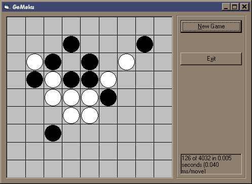

<div align="center">

## A Gomoku game with AI


</div>

### Description

This is a game of Gomoku. Traditionally, Gomoku is like a game of Tic-Tac-Toe except that you have to get 5 in a row and the playing board is either a 15x15 or a 19x19 GO board. For the purposes of this game, the board size is adjustable from 6x6 to 19x19 and the number needed to win is adjustable from 3 to 6. In a real Gomoku game, you have to have EXACTLY 5 in a row; 6 or more do not count. But for this game, 5 (or whatever) or more win.

The game demonstrates how to set up an evaluation function, how to set up a minimax search and how to prune using the alpha-beta algorithm.

The game looks ahead a certain number of plys (adjustable from 1 to 6) and picks the best move it can. Since a 15x15 board with 4 plys has up to 2.4 BILLION combinations, pruning the tree becomes important. The game does this by using the alpha beta algorithm. The algorithm works by comparing the value against a limit. If the limit is exceeded, the algorithm abandons the branch. An example in chess would be something like:

move (A) has been examined and will, at worst, capture a pawn. We now examine move (B). If we find that in one variation, move (B) will lose a pawn, we abandon the branch, even if at best, move (B) could capture a queen. The reason is because we assume our opponent will do the smartest possible move so we are going to lose a pawn, which is worse than gaining a pawn with move (A).

I wrote this in a bit of a hurry (I intend to use it as example source code in my resume) so I haven't finished commenting it yet. So please ask if you have any questions.

Oh yeah, please vote for me if you like it.

Also, if you beat the game on 4 ply or higher, let me know.
 
### More Info
 


<span>             |<span>
---                |---
**Submitted On**   |2000-11-09 11:23:16
**By**             |[Bill Soo](https://github.com/Planet-Source-Code/PSCIndex/blob/master/ByAuthor/bill-soo.md)
**Level**          |Intermediate
**User Rating**    |4.8 (62 globes from 13 users)
**Compatibility**  |VB 6\.0
**Category**       |[Games](https://github.com/Planet-Source-Code/PSCIndex/blob/master/ByCategory/games__1-38.md)
**World**          |[Visual Basic](https://github.com/Planet-Source-Code/PSCIndex/blob/master/ByWorld/visual-basic.md)
**Archive File**   |[CODE\_UPLOAD115141192000\.zip](https://github.com/Planet-Source-Code/bill-soo-a-gomoku-game-with-ai__1-12583/archive/master.zip)

### API Declarations

```
timeGetTime, but only for timing the code.
getinputstate
Uses a number of global variables.
```


